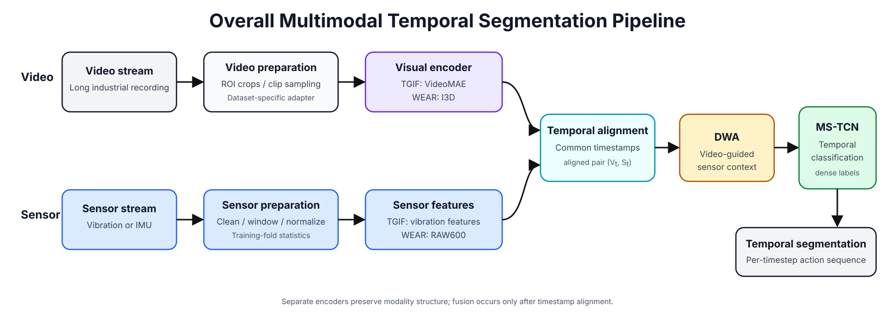
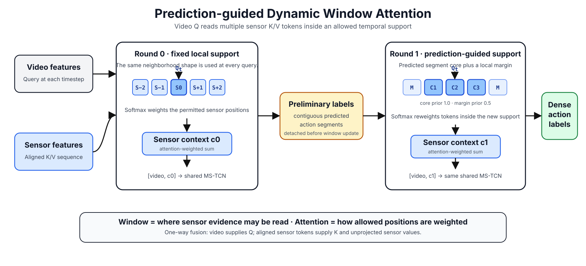
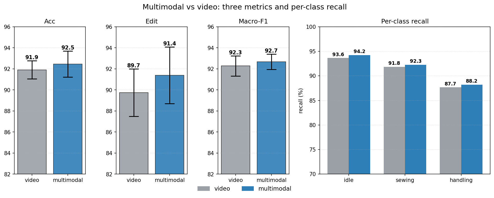
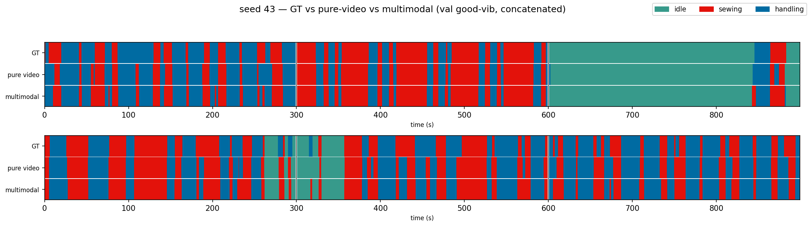
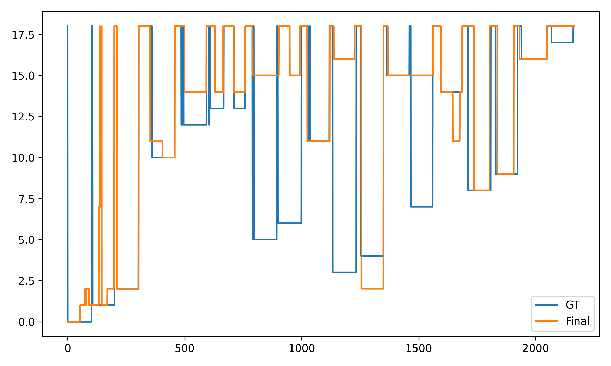

# TGIF Multimodal Temporal Segmentation

## Project overview

Industrial activity segmentation assigns an action label to every point in a
long recording. This project combines video with time-aligned vibration or
inertial measurements and implements Dynamic Window Attention (DWA), followed
by an MS-TCN, to produce dense temporal predictions. The repository presents
confirmed TGIF study results together with a maintained WEAR training,
inference, and evaluation baseline.

## Overall pipeline

<p align="center">
  
</p>

Video and sensor streams are prepared independently, encoded on a common time
grid, and passed to DWA. The attended sensor context is combined with the video
representation before temporal classification. TGIF uses global/operator ROI
VideoMAE features with vibration; WEAR uses I3D features with windowed IMU.

## DWA pipeline

A fixed sensor window can cross action boundaries and include evidence from a
different state. DWA first obtains a preliminary video-guided prediction, then
uses its contiguous segments to adjust the sensor attention range.

<p align="center">
  
</p>

The window determines **which temporal positions can be read**; one-way local
attention determines **how those permitted sensor positions are weighted** by
the video query. The attended context is concatenated with the video feature;
the attention weights are relative weights within the selected window, not a
calibrated sensor-reliability estimate. Equations, tensor dimensions, both
passes, the shared MS-TCN, training/inference behavior, and WEAR background
calibration are documented in [docs/method.md](docs/method.md).

## TGIF results

<p align="center">
  
</p>

On the TGIF sewing dataset, multimodal fusion improves accuracy from 91.9% to
92.5%, Edit score from 89.7% to 91.4%, and Macro-F1 from 92.3% to 92.7%.
Recall also increases for idle, sewing, and handling. These results indicate
that vibration provides complementary information for video-based activity
segmentation, with the largest reported gain observed in Edit score.

<p align="center">
  
</p>

*Seed 43 on the concatenated good-vibration validation subset. Both panels span
approximately 0–900 seconds and show GT, pure-video, and multimodal tracks.
Green, red, and blue denote idle, sewing, and handling, respectively.*

The two project-confirmed original figures are preserved without redrawing or
changing their values. The full six-metric table is in
[docs/results.md](docs/results.md).

## WEAR results

The comparison uses the first 18 WEAR subjects, leave-one-subject-out folds,
seed 47, and the 2 Hz feature grid. Concatenated Macro-F1 evaluates the combined
held-out-subject predictions over all 19 classes, including background.

| Method | Mean fold Macro-F1 | Concatenated Macro-F1 | Accuracy | mAP@0.5 | Avg mAP |
|---|---:|---:|---:|---:|---:|
| Video-only MS-TCN | 0.7292 ± 0.0861 | 0.7573 | 0.7929 | 0.6755 | 0.6814 |
| Final multimodal model | **0.7998 ± 0.1621** | **0.8109** | **0.8284** | **0.7756** | **0.7640** |

<p align="center">
  
</p>

*Existing WEAR class-ID trace over feature-grid index, showing ground truth and
the final multimodal prediction. It is a qualitative two-track example and does
not include the video-only prediction.*

The held-out subject in each fold was also used for best-epoch selection, so
these are validation-selected LOSO results. Record metrics use the 2 Hz feature
grid; TAL values are derived from contiguous MS-TCN predictions. Metric
definitions, the four-method comparison, and scope limits are in
[docs/results.md](docs/results.md).

## Quick start

```bash
git clone https://github.com/shureduan/TGIF-Multimodal-Temporal-Segmentation.git
cd TGIF-Multimodal-Temporal-Segmentation
conda env create -f environment.yml
conda activate tgif-temporal
python -m unittest discover -s tests -v
```

After preparing the WEAR feature-grid inputs described in
[docs/data.md](docs/data.md) and obtaining the matching parent/probe weights:

```bash
python scripts/verify_model_files.py --fold 1

python scripts/infer_wear.py \
  --data-root /path/to/WEAR_prepared \
  --subject sbj_0 \
  --parent models/wear_final/split_01/parent.pt \
  --probe models/wear_final/split_01/background_probe.pt \
  --output outputs/wear_split_01.npz

python scripts/evaluate_wear.py \
  outputs/wear_split_01.npz \
  --output outputs/wear_split_01_metrics.json
```

For fold training, configuration details, and result comparison, see
[docs/reproduction.md](docs/reproduction.md). The maintained code has been
checked for independent import, all 18 private WEAR checkpoint-pair loads,
full-sequence inference, and metric recomputation; the executed checks are
recorded in [VERIFICATION.md](VERIFICATION.md). Historical result presentation
and current release-code validation are reported separately.

## Data and models

- TGIF video, labels, ROI metadata, vibration, and derived features are
  laboratory assets and are not distributed by this repository.
- WEAR data and third-party features must be obtained under their own terms
  from the [WEAR project](https://mariusbock.github.io/wear/).
- The 18 WEAR parent/probe pairs total 95.90 MiB. Their verified
  [manifest](models/wear_final/manifest.json) is included, but the weights have
  not yet been uploaded and no download URL is currently available.

## Repository structure

```text
assets/              overall method, DWA, and confirmed result figures
configs/             model, protocol, and label metadata
docs/                method, data, results, models, and reproduction details
models/wear_final/   weight manifest; checkpoints remain external
results/             frozen TGIF and WEAR result tables
scripts/             WEAR training, inference, evaluation, and hash checks
src/tgif_dwa/        self-contained DWA and MS-TCN implementation
tests/               synthetic interfaces plus optional private-weight loading
```

## Scope

No claim is made about state of the art, real-time deployment, or broad
cross-domain generalization. A project license, stable citation metadata,
public model archive, and complete public data-preparation route remain release
tasks; third-party code, models, and datasets retain their own terms.
