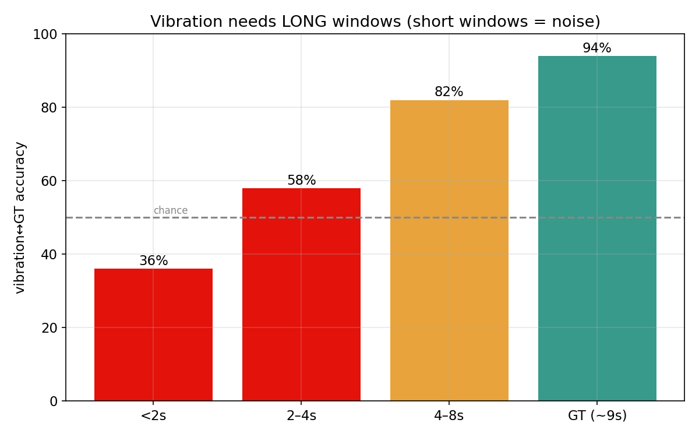
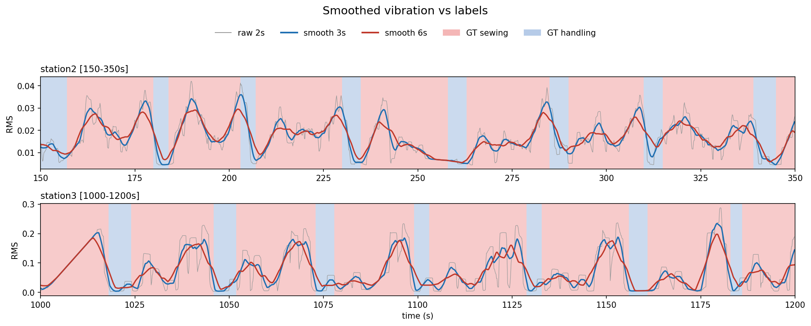
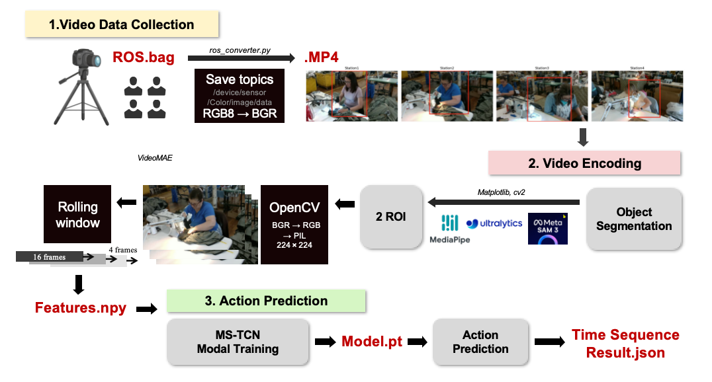
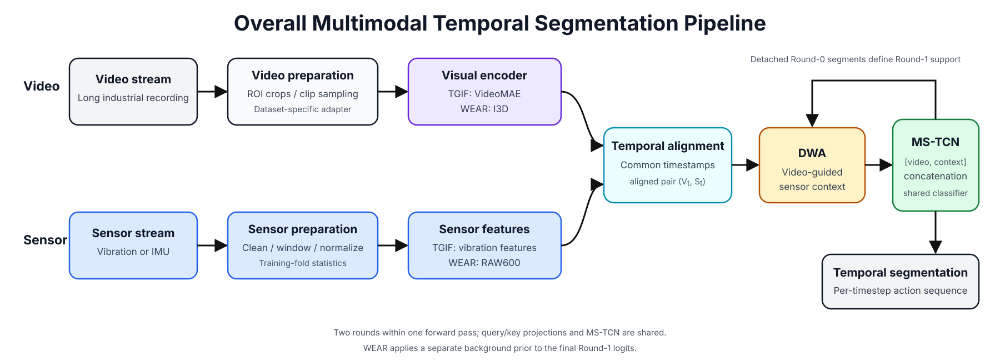
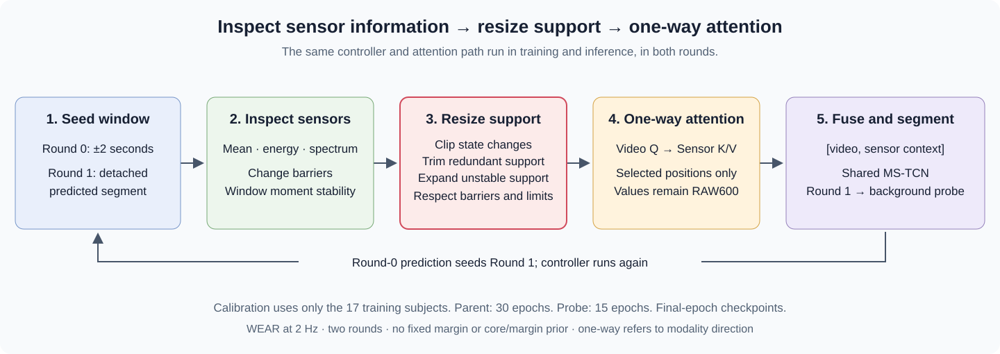
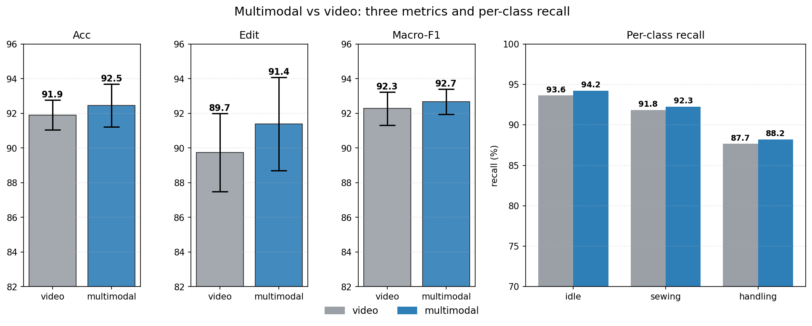
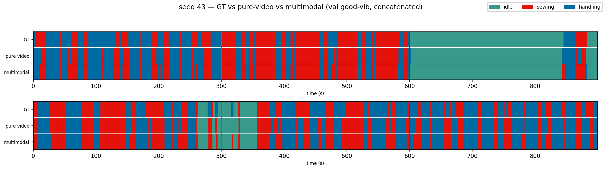
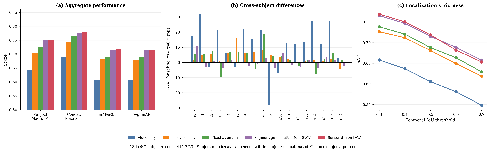
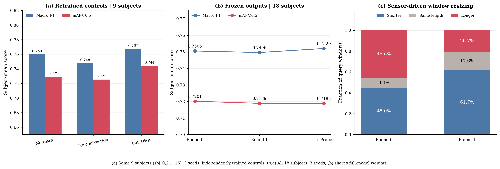
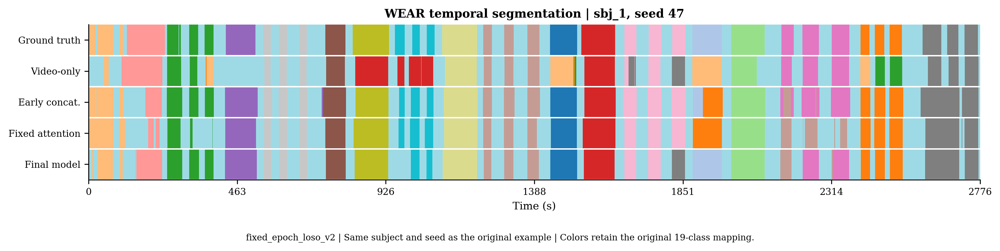

# TGIF Multimodal Temporal Segmentation

## Project overview

Industrial activity segmentation assigns an action label to every point in a
long recording. This project combines video with time-aligned vibration or
inertial measurements and implements Dynamic Window Attention (DWA) with a
shared MS-TCN in two successive rounds to produce dense temporal predictions.
The repository presents confirmed TGIF study results together with a maintained WEAR training,
inference, and evaluation baseline.

### Why dynamic sensor windows?

<p align="center">
  
</p>

The vibration-only diagnostic exposes a temporal-support problem. Accuracy is
36% below 2 seconds and 58% at 2–4 seconds, then rises to 82% at 4–8 seconds.
The 94% result uses an oracle window close to the ground-truth action duration
(about 9 seconds), which is not available during normal inference. A fixed
window must therefore trade off noisy short measurements against windows that
can span unrelated action states.

<p align="center">
  
</p>

*Vibration RMS at stations 2 and 3 with 2-second raw measurements and 3/6-second
smoothing. Background colors show the ground-truth sewing and handling
intervals.*

The traces show useful recurring sensor structure, but the appropriate temporal
extent changes with the predicted action segment and its boundaries. This is
the motivation for DWA: use an initial segmentation to define the sensor
support, apply video-query local attention within that support, and let MS-TCN
refine the dense action sequence.

### TGIF video baseline

<p align="center">
  
</p>

The TGIF video baseline converts ROS bag recordings to MP4, obtains two visual
ROIs, prepares rolling clips for VideoMAE feature extraction, and applies
MS-TCN for action prediction. The multimodal model extends this temporal video
path with aligned vibration evidence rather than replacing the video encoder.

## Overall pipeline

<p align="center">
  
</p>

Video and sensor streams are prepared independently, aligned on a common time
grid, and passed to DWA. In each round, the attended sensor context is
concatenated with the video representation and passed to the shared MS-TCN.
TGIF uses global/operator ROI VideoMAE features with vibration; WEAR uses I3D
features with windowed IMU.

## DWA pipeline

We study two window strategies for choosing the temporal extent of sensor
attention: **Segment-guided Window Attention (SWA)** uses the predicted action
segment plus a fixed margin; **Sensor-driven DWA** inspects the signal and
adapts the support itself. Both retain the same two-round multimodal backbone
and background probe and are compared side by side below.

The current WEAR model uses **sensor-driven window resizing before one-way
attention**. Round 0 starts with a ±2-second seed. Round 1 starts with the
previous round's detached predicted segment. In both rounds, sensor statistics
control contraction and expansion before the video query reads the selected
sensor keys and values.

<p align="center">
  
</p>

The controller detects sensor changes, trims redundant support and expands
unstable or undersampled windows. Its mean, energy and spectral descriptors
are calibrated using the training subjects only. Attention uses **Video Q →
Sensor K/V**; its weighted RAW600 context is concatenated with video and passed
to the shared MS-TCN. A separate background probe adjusts the final logits.
Training and inference use the same controller and attention path.

SWA retains the original v2 checkpoint identifier `FINAL_MODEL`. The
new DWA has no fixed margin or core/margin prior. Its serialized protocol ID
remains `signal_adaptive_loso_v3_candidate` for checkpoint compatibility.
Algorithm details, equations and code entry points are in
[docs/method.md](docs/method.md).

## TGIF results

<p align="center">
  
</p>

On the TGIF sewing dataset, multimodal fusion improves accuracy from 91.9% to
92.5%, Edit score from 89.7% to 91.4%, and Macro-F1 from 92.3% to 92.7%.
Recall also increases for idle, sewing, and handling. These results indicate
that vibration provides complementary information for video-based activity
segmentation, with the largest reported gain observed in Edit score.

<p align="center">
  
</p>

*Seed 43 on the concatenated good-vibration validation subset. Both panels span
approximately 0–900 seconds and show GT, pure-video, and multimodal tracks.
Green, red, and blue denote idle, sewing, and handling, respectively.*

The two project-confirmed original figures are preserved without redrawing or
changing their values. The full six-metric table is in
[docs/results.md](docs/results.md).

## WEAR results

The main comparison covers **18 LOSO subjects × 3 seeds (41/47/53)** on the
2 Hz feature grid. All parents use 30 fixed epochs; the two-round models also
use a 15-epoch background probe. Both components save the final epoch.
Normalization and sensor-controller calibration use the 17 training subjects
of each fold; held-out scores do not select checkpoints.

<p align="center">
  
</p>

*Aggregate performance, paired cross-subject changes in mAP@0.5, and temporal
localization performance from tIoU 0.3 to 0.7.*

| Method | Subject Macro-F1 (mean ± SD) | Concatenated Macro-F1 | Accuracy | mAP@0.5 | Avg mAP |
|---|---:|---:|---:|---:|---:|
| Video-only MS-TCN | 0.6419 ± 0.1246 | 0.6903 | 0.7461 | 0.6057 | 0.6061 |
| Early concatenation | 0.7048 ± 0.2110 | 0.7443 | 0.7734 | 0.6811 | 0.6776 |
| Fixed-window attention | 0.7246 ± 0.2071 | 0.7635 | 0.7843 | 0.6880 | 0.6880 |
| Segment-guided Window Attention (SWA) | 0.7500 ± 0.1892 | 0.7748 | 0.8008 | 0.7154 | **0.7148** |
| **Sensor-driven DWA (final)** | **0.7520 ± 0.1782** | **0.7811** | **0.8040** | **0.7188** | 0.7147 |

**DWA delivers the best overall performance in this comparison, with the highest
mean subject Macro-F1 (0.7520), concatenated Macro-F1 (0.7811), accuracy (0.8040)
and mAP@0.5 (0.7188).** Relative to fixed-window attention, its mean Macro-F1 rises
by **2.74 percentage points** and mAP@0.5 by **3.08 points**. Relative to the
SWA reference, those mean gains are 0.20 and 0.34 points.
These comparisons describe the complete model recipes; the component study
below isolates window resizing with matched retraining.

Bold numbers mark the highest mean in each column. Subject scores average the
three seeds first, then report mean ± sample SD across 18 subjects.
Concatenated Macro-F1 pools the 18 sequences within each seed, then averages
three scores. F1 includes all 19 classes; accuracy and mAP weight subjects and
seeds equally. Complete numerical comparisons, including paired statistics,
are in [results/wear_signal_v3/](results/wear_signal_v3/).

<p align="center">
  
</p>

*Component study: full DWA, no resizing and no contraction are independently
trained on the same 9 held-out subjects (`sbj_0,2,...,16`) × 3 seeds. Full DWA
reaches 0.7672 Macro-F1 versus 0.7598 without resizing. Frozen Round-0/parent/probe
outputs and window measurements use all 18 subjects. Each panel labels its
cohort; the component subset is not the 18-subject main result.*

<p align="center">
  
</p>

*The original `sbj_1`, seed 47 example and class-color mapping are retained;
the new DWA prediction is added. The second original example (`sbj_9`) and
all 12 metrics, class scores and seed comparisons are in the
[figure gallery](docs/results.md#wear-figures).*

Record metrics use the 2 Hz feature grid; TAL values come from contiguous
MS-TCN predictions. [Results and metric definitions](docs/results.md),
[method](docs/method.md), and [reproduction commands](docs/reproduction.md)
provide the full path from inputs and weights to tables and figures.

## Quick start

```bash
git clone https://github.com/shureduan/TGIF-Multimodal-Temporal-Segmentation.git
cd TGIF-Multimodal-Temporal-Segmentation
conda env create -f environment.yml
conda activate tgif-temporal
python -m unittest discover -s tests -v
```

Download the [sensor-driven DWA weights](https://github.com/shureduan/TGIF-Multimodal-Temporal-Segmentation/releases/tag/wear-signal-v3-20261007),
then infer without training. Prepare I3D/RAW600 inputs as described in
[docs/data.md](docs/data.md).

```bash
# Default: all 18 DWA parent/probe pairs for seed 47 (~88 MiB).
# Archive and individual checkpoint SHA-256 checks run automatically.
python scripts/download_signal_weights.py

python scripts/infer_wear_signal.py \
  --data-root /path/to/WEAR_prepared --subject sbj_0 \
  --parent models/wear_signal_v3/SIGNAL_ADAPTIVE_DWA/seed_47/split_01/parent.pt \
  --probe models/wear_signal_v3/SIGNAL_ADAPTIVE_DWA/seed_47/split_01/background_probe.pt \
  --device cpu --output outputs/wear_signal_split_01.npz

python scripts/evaluate_wear.py \
  outputs/wear_signal_split_01.npz --output outputs/wear_signal_split_01_metrics.json
```

Fold `f` holds out `sbj_{f-1}`. Keep the parent and probe from the same fold,
seed and method. One fold is a quick check; the aggregate uses all 18 folds
and three seeds. [docs/models.md](docs/models.md) covers all weights, including
the matching baselines and nine-subject controls.

Redraw the figures directly from committed numerical inputs, without data,
weights or training:

```bash
python -m pip install -e '.[plot]'
python scripts/plot_signal_results.py --output outputs/wear_signal_figures
```

This creates six PNGs, individual PDFs and `WEAR_sensor_DWA_results.pdf`.
To regenerate scores from pretrained checkpoints or retrain the models, follow
[docs/reproduction.md](docs/reproduction.md).

## Data and models

- TGIF video, labels, ROI metadata, vibration, and derived features are
  laboratory assets and are not distributed by this repository.
- WEAR data and third-party features must be obtained under their own terms
  from the [WEAR project](https://mariusbock.github.io/wear/).
- The [sensor-driven DWA release](https://github.com/shureduan/TGIF-Multimodal-Temporal-Segmentation/releases/tag/wear-signal-v3-20261007)
  provides 54 full-model parent/probe pairs plus 27 pairs for each published
  control. The [v2 release](https://github.com/shureduan/TGIF-Multimodal-Temporal-Segmentation/releases/tag/wear-v2-pretrained-20261006)
  provides the four reference models. Their immutable manifests are under
  `models/`. These are downstream segmentation weights; feature extraction
  weights and dataset files are obtained separately.

## Repository structure

```text
assets/              overall method, DWA, and confirmed result figures
configs/             model, protocol, and label metadata
docs/                method, data, results, models, and reproduction details
models/wear_signal_v3/ current DWA and control checkpoint manifest
models/wear_v2/       reference-model checkpoint manifest
models/wear_final/   historical checkpoint manifest
results/wear_signal_v3/ current WEAR scores, statistics and figure inputs
results/             TGIF tables and archived WEAR v2 inputs
scripts/             WEAR training, inference, evaluation, and plotting
src/tgif_dwa/        self-contained DWA and MS-TCN implementation
tests/               synthetic interfaces plus optional private-weight loading
```
