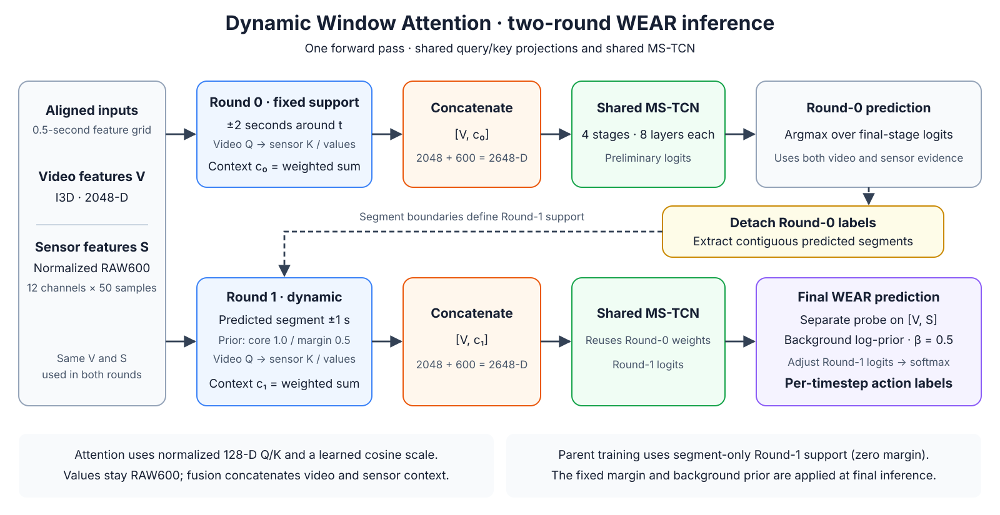

# TGIF Multimodal Temporal Segmentation

## Project overview

Industrial activity segmentation assigns an action label to every point in a
long recording. This project combines video with time-aligned vibration or
inertial measurements and implements Dynamic Window Attention (DWA) with a
shared MS-TCN in two successive rounds to produce dense temporal predictions.
The repository presents confirmed TGIF study results together with a maintained WEAR training,
inference, and evaluation baseline.

### Why dynamic sensor windows?

<p align="center">
  
</p>

The vibration-only diagnostic exposes a temporal-support problem. Accuracy is
36% below 2 seconds and 58% at 2–4 seconds, then rises to 82% at 4–8 seconds.
The 94% result uses an oracle window close to the ground-truth action duration
(about 9 seconds), which is not available during normal inference. A fixed
window must therefore trade off noisy short measurements against windows that
can span unrelated action states.

<p align="center">
  
</p>

*Vibration RMS at stations 2 and 3 with 2-second raw measurements and 3/6-second
smoothing. Background colors show the ground-truth sewing and handling
intervals.*

The traces show useful recurring sensor structure, but the appropriate temporal
extent changes with the predicted action segment and its boundaries. This is
the motivation for DWA: use an initial segmentation to define the sensor
support, apply video-query local attention within that support, and let MS-TCN
refine the dense action sequence.

### TGIF video baseline

<p align="center">
  
</p>

The TGIF video baseline converts ROS bag recordings to MP4, obtains two visual
ROIs, prepares rolling clips for VideoMAE feature extraction, and applies
MS-TCN for action prediction. The multimodal model extends this temporal video
path with aligned vibration evidence rather than replacing the video encoder.

## Overall pipeline

<p align="center">
  
</p>

Video and sensor streams are prepared independently, aligned on a common time
grid, and passed to DWA. In each round, the attended sensor context is
concatenated with the video representation and passed to the shared MS-TCN.
TGIF uses global/operator ROI VideoMAE features with vibration; WEAR uses I3D
features with windowed IMU.

## DWA pipeline

A fixed sensor window can cross action boundaries and include evidence from a
different state. DWA first uses fixed-window video-to-sensor attention and the
shared MS-TCN to obtain a preliminary multimodal prediction (Round 0). Its
contiguous predicted segments then define the sensor support for Round 1.

<p align="center">
  
</p>

*Maintained WEAR training and inference configuration: Round 0 uses a ±2-second window;
Round 1 uses the predicted segment plus a ±1-second margin, with temporal
priors of 1.0 in the segment and 0.5 in the margin. Both rounds run within one
forward pass and share the query/key projections and MS-TCN.*

The window determines **which temporal positions can be read**; one-way local
attention determines **how those permitted sensor positions are weighted** by
the video query. The resulting sensor context is fused with the video
representation by concatenation for temporal segmentation. WEAR training and
inference use the same segment-plus-margin support and temporal priors. The
final model additionally applies a separately trained background probe.
Equations, tensor dimensions, and background calibration are documented in
[docs/method.md](docs/method.md).

## TGIF results

<p align="center">
  
</p>

On the TGIF sewing dataset, multimodal fusion improves accuracy from 91.9% to
92.5%, Edit score from 89.7% to 91.4%, and Macro-F1 from 92.3% to 92.7%.
Recall also increases for idle, sewing, and handling. These results indicate
that vibration provides complementary information for video-based activity
segmentation, with the largest reported gain observed in Edit score.

<p align="center">
  
</p>

*Seed 43 on the concatenated good-vibration validation subset. Both panels span
approximately 0–900 seconds and show GT, pure-video, and multimodal tracks.
Green, red, and blue denote idle, sewing, and handling, respectively.*

The two project-confirmed original figures are preserved without redrawing or
changing their values. The full six-metric table is in
[docs/results.md](docs/results.md).

## WEAR results

The current results use `fixed_epoch_loso_v2`: the first 18 WEAR subjects,
leave-one-subject-out folds, seeds 41/47/53, and the 2 Hz feature grid. Parent
and probe training use fixed budgets of 30 and 15 epochs and save the final
epoch. Held-out subjects are evaluated after training; their scores are not
used for checkpoint selection.

<p align="center">
  
</p>

*Aggregate performance, paired cross-subject changes in mAP@0.5, and temporal
localization performance from tIoU 0.3 to 0.7.*

| Method | Subject Macro-F1 (mean ± SD) | Concatenated Macro-F1 | Accuracy | mAP@0.5 | Avg mAP |
|---|---:|---:|---:|---:|---:|
| Video-only MS-TCN | 0.6419 ± 0.1246 | 0.6903 | 0.7461 | 0.6057 | 0.6061 |
| Early concatenation | 0.7048 ± 0.2110 | 0.7443 | 0.7734 | 0.6811 | 0.6776 |
| Fixed-window attention | 0.7246 ± 0.2071 | 0.7635 | 0.7843 | 0.6880 | 0.6880 |
| Final multimodal model | 0.7500 ± 0.1892 | 0.7748 | 0.8008 | 0.7154 | 0.7148 |

Subject scores first average the three seeds, then report the mean and sample
SD across 18 subjects. Concatenated Macro-F1 pools the 18 subject sequences
within each seed, then averages the three scores; this is the F1 used in the
figure. F1 includes all 19 classes. Accuracy and mAP average subjects and seeds
equally. The final model has higher mean scores in this run; superiority over
fixed attention is not established by the paired statistical comparisons.

<p align="center">
  
</p>

*Inference interventions on the same 54 frozen parents, boundary-jitter
robustness, and attention mass within the prediction-guided support. These
component outputs are not independently retrained ablations.*

<p align="center">
  
</p>

*Subject `sbj_1`, seed 47: Ground truth, Video-only, Early concatenation, Fixed
attention, and the Final model with a shared class-color mapping. The subject
and seed are retained from the previous example, without selection on the new
scores.*

Record metrics use the 2 Hz feature grid; TAL values are derived from contiguous
MS-TCN predictions. Metric definitions, source tables, component results and
scope limits are in [docs/results.md](docs/results.md). The full training and
figure reproduction commands are in [docs/reproduction.md](docs/reproduction.md).

## Quick start

```bash
git clone https://github.com/shureduan/TGIF-Multimodal-Temporal-Segmentation.git
cd TGIF-Multimodal-Temporal-Segmentation
conda env create -f environment.yml
conda activate tgif-temporal
python -m unittest discover -s tests -v
```

After preparing the WEAR feature-grid inputs described in
[docs/data.md](docs/data.md), train and evaluate one fold:

```bash
python scripts/check_wear_data.py --data-root /path/to/WEAR_prepared

OMP_NUM_THREADS=1 python scripts/train_wear.py \
  --data-root /path/to/WEAR_prepared \
  --fold 1 --seed 47 --method FINAL_MODEL \
  --parent-epochs 30 --probe-epochs 15 \
  --device cpu --output outputs/wear_training

python scripts/infer_wear.py \
  --data-root /path/to/WEAR_prepared --subject sbj_0 \
  --parent outputs/wear_training/FINAL_MODEL/seed_47/split_01/parent.pt \
  --probe outputs/wear_training/FINAL_MODEL/seed_47/split_01/background_probe.pt \
  --device cpu --output outputs/wear_split_01.npz

python scripts/evaluate_wear.py \
  outputs/wear_split_01.npz --output outputs/wear_split_01_metrics.json
```

To redraw the four WEAR figures from the committed numerical inputs, without
training or private data:

```bash
python -m pip install -e '.[plot]'
python scripts/plot_wear_results.py --output outputs/wear_figures
```

This writes four PNGs and a combined PDF. For the complete 18-fold, three-seed
benchmark and regenerating figure inputs from trained checkpoints, see
[docs/reproduction.md](docs/reproduction.md).

## Data and models

- TGIF video, labels, ROI metadata, vibration, and derived features are
  laboratory assets and are not distributed by this repository.
- WEAR data and third-party features must be obtained under their own terms
  from the [WEAR project](https://mariusbock.github.io/wear/).
- Current WEAR v2 checkpoints are not bundled; the commands above train them
  from prepared inputs. The [legacy manifest](models/wear_final/manifest.json)
  describes an older 18-pair, 95.90 MiB bundle and does not match the current
  results. No public checkpoint download is currently available.

## Repository structure

```text
assets/              overall method, DWA, and confirmed result figures
configs/             model, protocol, and label metadata
docs/                method, data, results, models, and reproduction details
models/wear_final/   weight manifest; checkpoints remain external
results/             TGIF tables, WEAR v2 metrics, and figure inputs
scripts/             WEAR training, inference, evaluation, and plotting
src/tgif_dwa/        self-contained DWA and MS-TCN implementation
tests/               synthetic interfaces plus optional private-weight loading
```
